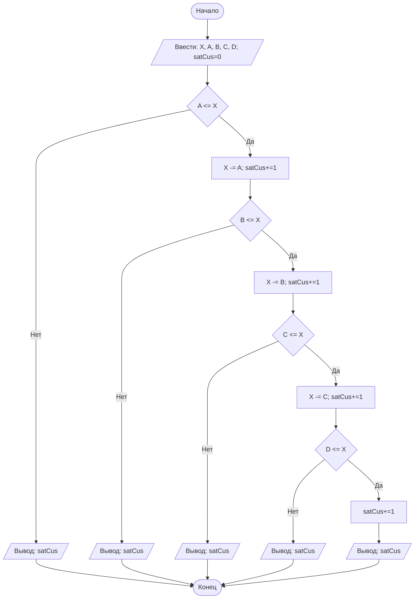

## Отчет по лабораторной работе № 1

#### № группы: `ПМ-2402`

#### Выполнил: `Ратникова Аглая Климовна`

#### Вариант: `20`

### Cодержание:

- [Постановка задачи](#1-постановка-задачи)
- [Входные и выходные данные](#2-входные-и-выходные-данные)
- [Выбор структуры данных](#3-выбор-структуры-данных)
- [Алгоритм](#4-алгоритм)
- [Программа](#5-программа)
- [Анализ правильности решения](#6-анализ-правильности-решения)

### 1. Постановка задачи

> 4 покупателя стоят в очереди за бананами. Они планируют купить A, B, C, D килограмм бананов 
> соответственно порядку в очереди (или все оставшиеся, если к моменту обслуживания покупателя в магазине остаётся 
> меньше бананов, чем планирует купить покупатель). Изначально в магазине имеется X кг бананов. Сколько покупателей
> смогут купить бананы, которые они планируют? На вход программы подаются натуральные числа X, A, B, C, D.

Нам нужно найти количество покупателей, которые купили столько бананов, сколько захотели. Чтобы первый 
покупатель смог приобрести желаемое количество бананов X должен быть больше или равен A: тогда количество довольных 
покупателей вырастет на 1, а количество бананов в магазине сократится на A. Если это не так,
то количество покупателей, удовлетворивших свою жажду бананов, остается 0 (т.к. первый покупатель
купит все оставшиеся). Аналогичные действия надо провести с  B, C, D. 

### 2. Входные и выходные данные

#### Данные на вход

На вход программа должна получать 5 натуральных чисел. Верхние и нижние границы дам согласно 
определению множества N.

|             | Тип               | min значение | max значение  |
|-------------|-------------------|--------------|---------------|
| X (Число 1) | Натуральное число |      1       | бесконечность |
| A (Число 2) | Натуральное число |      1       | бесконечность |
| B (Число 3) | Натуральное число |      1       | бесконечность |
| С (Число 4) | Натуральное число |      1       | бесконечность |
| D (Число 5) | Натуральное число |      1       | бесконечность |

#### Данные на выход

Т.к. программа должна вывести количество покупателей, то это целое неотрицательное число.

|         | Тип               | min значение | max значение  |
|---------|-------------------|--------------|---------------|
| Число 1 | Натуральное число |      0       | бесконечность |

### 3. Выбор структуры данных

Программа получает 5 натуральных чисел, для которых выделю 5 переменных `int`.

|             | название переменной | Тип (в Java) | 
|-------------|---------------------|--------------|
| X (Число 1) | `X`                 | `int`        |
| A (Число 2) | `A`                 | `int`        | 
| B (Число 3) | `B`                 | `int`        |
| C (Число 4) | `C`                 | `int`        |
| D (Число 5) | `D`                 | `int`         |

Для вывода результата необязательно его хранить в отдельной переменной.

### 4. Алгоритм

#### Алгоритм выполнения программы:

1. **Ввод данных:**  
   Программа считывает пять натуральных чисел, обозначенных `X`, `A`, `B`, `C`, `D`.
2. **Задание переменной:**
   Целое неотрицательное число, обозначенное `satisfiedCustomers`, равное 0.
3. **Сравнение чисел и присваивание новых значений переменной:**
   Программа сравнивает значения `X` и `A`. Если `X` больше или равен `A`, то к переменной `satisfiedCustomers`
   прибавляется единица и значение переменной `X` уменьшается на значение переменной `A`. Если нет, то 
   программа переходит к следующему шагу работы с переменной `satisfiedCustomers`. Аналогичные действия 
   происходят с переменной `B`, `C` и `D`(после сравнения переменной `D`  с переменной `X` переменной `X` 
   не присваивается новое значение за ненадобностью). 
4. **Вывод результата**
   Программа выводит значение переменной `satisfiedCustomers`.

#### Блок-схема



### 5. Программа

```java
import java.io.PrintStream;
import java.util.Scanner;

public class Main {
   // Объявляем объект класса Scanner для ввода данных
   public static Scanner in = new Scanner(System.in);
   // Объявляем объект класса PrintStream для вывода данных
   public static PrintStream out = System.out;
   public static void main(String[] args) {
      // Считывание пяти целых чисел X,A,B,C,D из консоли
      int X = in.nextInt();
      int A = in.nextInt();
      int B = in.nextInt();
      int C = in.nextInt();
      int D = in.nextInt();
      int satisfiedCustomers = 0;
      // Объявляем количество покупателей, которые смогли купить планируемое количество бананов
      if (A<=X) {
         // Сравниваем: хватит ли бананов в магазине, чтобы покупатель A ушел довольным.
         // Если хватит, то один покупатель уходит довольным, соответственно количество satisfiedCustomers
         // увеличивается на 1. Также количество бананов в магазине уменьшится на то количество, сколько купил A.
         // Если бананов не хватает, то вывожу количество довольных покупателей на данный момент.
         satisfiedCustomers+=1;
         X -= A;
         if (B<=X) {
            // Делаем то же самое, что и для цикла с покупателем A.
            satisfiedCustomers+=1;
            X -= B;
            if (C<=X){
               // Делаем то же самое, что и для цикла с покупателем A.
               satisfiedCustomers+=1;
               X -= C;
               if (D<=X){
                  // Сравниваем: хватит ли бананов в магазине, чтобы покупатель D ушел довольным.
                  // Если хватит, то один покупатель уходит довольным, соответственно, количество satisfiedCustomers
                  // увеличивается на 1. После выводим количество довольных покупателей, так как очередь кончилась.
                  // Если бананов не хватает, то вывожу количество довольных покупателей на данный момент.
                  satisfiedCustomers+=1;
                  out.print(satisfiedCustomers);
               }
               else{
                  out.print(satisfiedCustomers);
               }
            }
            else{
               out.print(satisfiedCustomers);
            }
         }
         else{
            out.print(satisfiedCustomers);
         }
      }
      else {
         out.print(satisfiedCustomers);
      }

   }
}

```

### 6. Анализ правильности решения

Программа работает корректно на всем множестве решений с учетом ограничений.

1. Тест на `A > X`:

    - **Input**:
        ```
        10 12 2 2 2 
        ```

    - **Output**:
        ```
        0
        ```

2. Тест на `A = X`:

    - **Input**:
        ```
        10 10 2 2 2
        ```

    - **Output**:
        ```
        1
        ```

3. Тест на `A + B + C + D <= X `:

    - **Input**:
        ```
        10 2 2 2 2 
        ```

    - **Output**:
        ```
        4
        ```

4. Тест на `A + B + C <= X` и `A + B + C + D > X`:

   - **Input**:
       ```
       10 2 2 2 10
       ```

   - **Output**:
       ```
       3
       ```